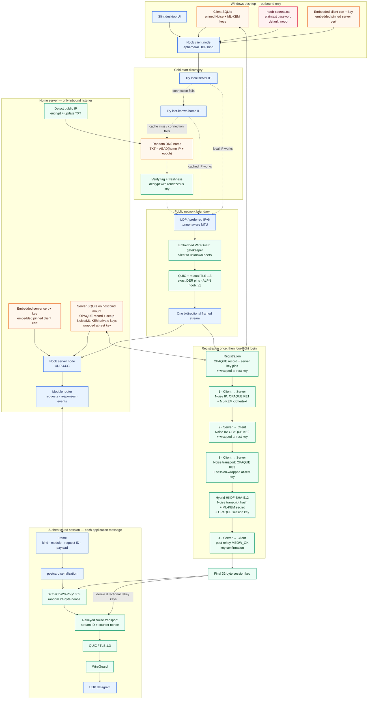
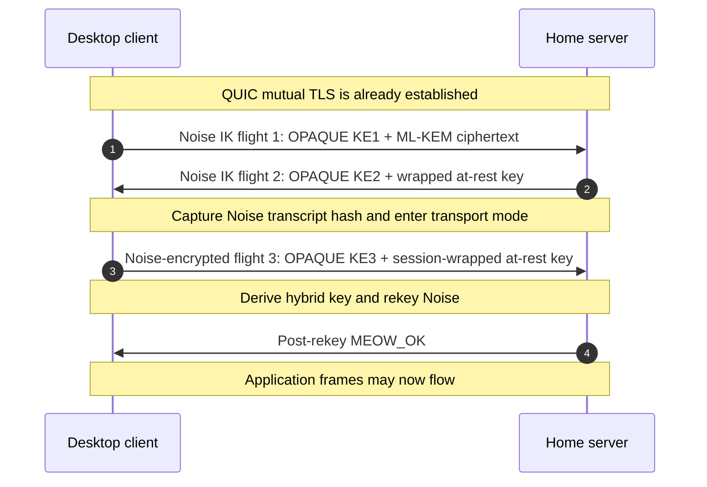

## Security stack

- Network concealment
  - WireGuard is embedded through `boringtun` underneath QUIC as a silent public-port
    gatekeeper.
  - The client tries the server's local IP first, then its last-known public IP.
  - For cold-start discovery, the server publishes its public IP and an epoch in an
    AEAD-encrypted DNS TXT record. The rendezvous key is embedded at compile time.
  - The Cloudflare record uses a long random subdomain. This provides obscurity,
    not an additional security boundary.
  - IPv6 is preferred when available, and QUIC uses tunnel-aware MTU settings.

- QUIC and mutual TLS 1.3
  - Both peers require an exact byte-for-byte match against an embedded DER
    certificate. There is no CA, hostname validation, expiry check or OCSP.
  - ALPN is `noob_v1`.
  - The client certificate and key are shared because every client is built from
    the same compile-time bundle.

- Enrollment and server-key pinning
  - OPAQUE registration creates the `owner` password record without storing the
    password itself.
  - The client records the server's Noise static public key and ML-KEM public key.
  - These keys are trusted on first enrollment and pinned in the client database.
  - A TLS fingerprint is also stored, but it is currently all zeroes and is not
    checked by the authentication code.

- Authenticated hybrid login
  - Noise `IK` uses X25519, ChaCha20-Poly1305 and SHA-256.
  - The pinned Noise key authenticates the server, the client's Noise key is fresh
    per login, so stable client authentication comes from mutual TLS and OPAQUE.
  - OPAQUE uses Ristretto255, 3DH, SHA-512 and Argon2 to prove password knowledge.
  - A fourth flight confirms that both sides derived the same final key.

- Hybrid session key
  - The final 32-byte key is:
    `HKDF-SHA-512(salt = Noise transcript hash, ikm = ML-KEM secret || OPAQUE session key, info = "noob:transport:final:v1")`.
  - The result rekeys Noise into separate initiator and responder keys.
  - This binds the classical Noise transcript, the post-quantum KEM and password
    authentication into one session key.

- Application data
  - Frames are serialized with `postcard`.
  - On each stream, XChaCha20-Poly1305 encrypts first, Noise encrypts that result,
    QUIC encrypts the Noise ciphertext, and WireGuard carries the QUIC packets.

## Complete architecture and data flow

## Login flights

